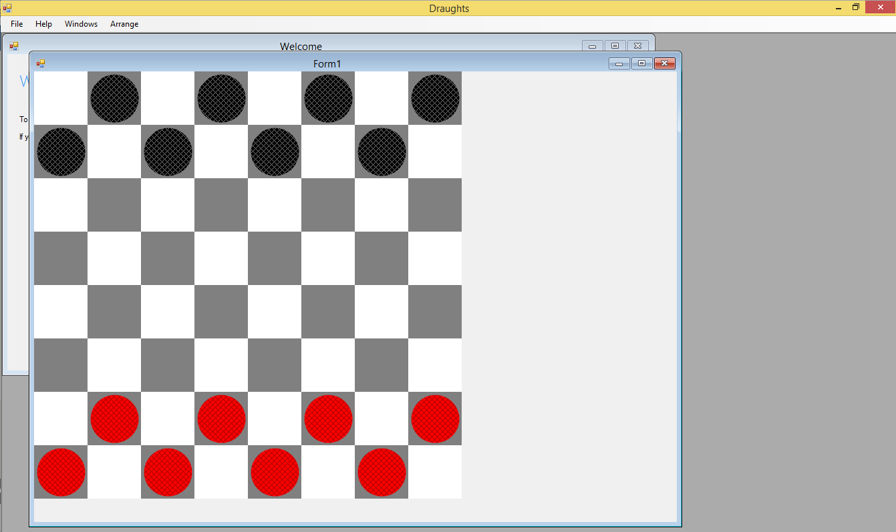
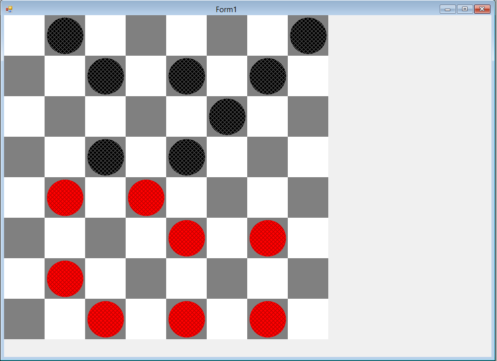
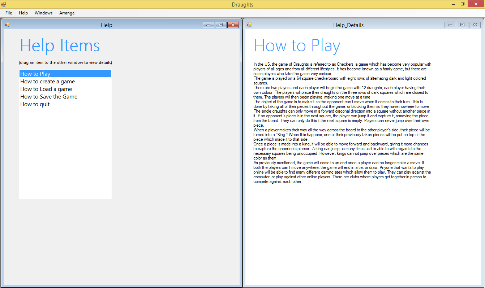

# Draughts/Checkers game

## Overview

Publishing some of my college work in case some other students might find it
of use. This project was to create a game in web forms, I chose draughts.

Features
- Drag and drop
- Drag between windows
- Web Forms
- Save (Serialisation)
- Load (Deserialisation)
- Model transfer
- Loading from JSON files
- Board generation

> Some features will see strange and they probably just exist to meet a
requirement from the brief.

## The game

